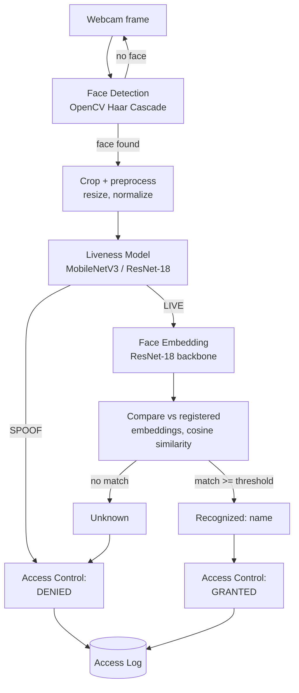

# Anti-Spoofing Face Liveness Detection for Robust AI-Based Access Control System

A hackathon-scoped, end-to-end access-control demo: a webcam feed is
checked for a live human face (not a photo, screen replay, or other
spoof), and — only if that check passes — matched against a small
local registry of enrolled users. Access is granted only when both
checks succeed.

**Status: 11 of 14 stages complete** (project structure through a
dedicated error-handling audit). Remaining: code-quality pass and
final integration testing.

---

## Table of contents

1. [Problem statement](#problem-statement)
2. [Motivation](#motivation)
3. [Features](#features)
4. [System architecture](#system-architecture)
5. [Technologies](#technologies)
6. [Dataset](#dataset)
7. [Dataset preparation](#dataset-preparation)
8. [Installation](#installation)
9. [Training](#training)
10. [Evaluation](#evaluation)
11. [Running the application](#running-the-application)
12. [How face registration works](#how-face-registration-works)
13. [How authentication works](#how-authentication-works)
14. [Attack scenarios](#attack-scenarios)
15. [Results](#results)
16. [Limitations](#limitations)
17. [Future improvements](#future-improvements)
18. [Ethical and privacy considerations](#ethical-and-privacy-considerations)
19. [Testing](#testing)
20. [Team / contributors](#team--contributors)

---

## Problem statement

Face-based access control is convenient but vulnerable to a simple
attack: show the camera a photo, video, or screen replay of an
authorized person's face instead of the person themselves. A
recognition system that only checks *identity* — "does this face match
someone in the database?" — has no way to tell a live person from a
printout of one. This project adds a **liveness check** in front of
recognition, so a spoofed face is rejected before identity is ever
considered.

## Motivation

Liveness detection is a real, actively-researched problem in biometric
security (ISO/IEC 30107-3 formalizes how presentation-attack detection
systems are evaluated — the APCER/BPCER/ACER metrics used here come
from that standard). This project demonstrates the core idea — detect,
verify liveness, then recognize, gated in that order — as a working,
inspectable prototype, not a production security product.

## Features

- Real-time webcam face detection (OpenCV Haar Cascade).
- Real-time liveness classification (LIVE vs SPOOF) via a small
  transfer-learned CNN (MobileNetV3-Small or ResNet-18).
- Face enrollment: capture a photo, generate a face embedding, store
  it under a name (SQLite, embeddings only — never raw images).
- Face recognition: cosine-similarity matching against enrolled
  embeddings, evaluated **only** on faces that already passed the
  liveness check.
- A single, centralized access-control rule (`src/access_control.py`)
  that is defensive against being called incorrectly.
- Every access attempt — granted or denied — logged with timestamps
  and confidence scores, viewable in the app.
- Dataset preprocessing with **subject-level train/val/test
  splitting** to avoid data leakage.
- Training and evaluation scripts with real, measured metrics
  (accuracy, precision, recall, F1, confusion matrix, APCER, BPCER,
  ACER) — nothing here is a placeholder or invented number.
- Explicit **DEMO MODE** whenever a real trained model isn't
  available, so the app never silently fakes an AI result.
- Runs without a GPU; trains in minutes on a laptop CPU or Colab.

## System architecture



Module map (what actually implements each box above):

| Stage | Module |
|---|---|
| Face detection, cropping | `src/face_detection.py` |
| Liveness model + inference | `src/liveness.py` |
| Liveness training / evaluation | `scripts/train_liveness.py`, `scripts/evaluate_liveness.py` |
| Face embedding + matching | `src/face_recognition.py` |
| User storage, access log storage | `src/database.py` |
| The GRANTED/DENIED rule (single source of truth) | `src/access_control.py` |
| Dataset conversion, subject-level split | `scripts/preprocess_dataset.py` |
| UI (Dashboard / Register / Logs) | `app.py` |
| Configuration (all paths & thresholds) | `config.py` |

The **access-control rule is intentionally isolated** in its own
tiny module so it's trivial to audit:

```python
if liveness == "SPOOF":
    access = "DENIED"
elif liveness == "LIVE":
    access = "GRANTED" if recognized_user else "DENIED"
```

Nothing else in the codebase independently decides GRANTED/DENIED, and
`decide_access()` is defensive on its own — even a caller bug that
passes a recognized name alongside a SPOOF label still gets DENIED.

## Technologies

- **Language:** Python 3.10+
- **Computer vision:** OpenCV (face detection, image I/O)
- **Deep learning:** PyTorch + torchvision (liveness CNN, embedding
  backbone — both are ImageNet-pretrained MobileNetV3-Small / ResNet-18,
  fine-tuned or reused via transfer learning)
- **Evaluation:** scikit-learn (metrics), matplotlib (confusion matrix
  plot)
- **Storage:** SQLite (via Python's built-in `sqlite3`) — no external
  database server needed
- **UI:** Streamlit
- **Testing:** pytest

**Why not `dlib`/`face_recognition`?** That popular library requires
compiling `dlib` from source (CMake + a C++ toolchain), which is a
common source of setup failure on Windows. This project reuses
torchvision instead (already a dependency for the liveness model),
which installs with plain `pip install` on every platform.

## Dataset

This project does not bundle or auto-download any face dataset.
Recommended public face anti-spoofing datasets (you must request
access from each dataset's own authors and agree to their license
terms):

- **MSU-MFSD** (MSU Mobile Face Spoofing Database) — primary
  recommendation.
- CASIA-FASD
- Replay-Attack
- OULU-NPU
- SiW

No faces are scraped from the internet anywhere in this project.

## Dataset preparation

`scripts/preprocess_dataset.py` converts a raw dataset into:

```
data/
    train/
        live/
        spoof/
    val/
        live/
        spoof/
    test/
        live/
        spoof/
```

Point it at raw data organized as two top-level folders, `live/` and
`spoof/`, containing either:
- **Flat files** with a subject-ID filename prefix (default), e.g.
  `client007_frame_012.jpg`, or
- **One folder per subject**, e.g. `live/client007/*.jpg` (pass
  `--subject-folders`).

Images (`.jpg`, `.png`, `.bmp`) and videos (`.mp4`, `.avi`, `.mov`,
`.mkv`) are both supported — videos are sampled every Nth frame
(`--frame-stride`, default 10) rather than every frame, to avoid
near-duplicate frames dominating the dataset.

```bash
python scripts/preprocess_dataset.py \
  --raw-dir /path/to/raw_dataset \
  --out-dir data \
  --train-ratio 0.7 --val-ratio 0.15 --test-ratio 0.15 \
  --clean
```

### Why subject-level splitting matters (avoiding data leakage)

Frames from the same video — or different videos of the same person —
are highly correlated (same face, similar lighting/background). If
individual frames were randomly split across train/val/test, the model
could effectively "memorize" a subject it already saw during training
and appear to perform far better on the test set than it actually
would on a genuinely unseen person. This script splits by **subject
ID**, guaranteeing every person's data stays entirely within one split.
This guarantee is verified by an automated test
(`test_split_subjects_no_overlap`) rather than just asserted.

## Installation

```bash
python -m venv .venv

# Windows:
.venv\Scripts\activate
# macOS/Linux:
source .venv/bin/activate

pip install -r requirements.txt
```

If a dependency is difficult to install on your machine, see the
"Why not `dlib`/`face_recognition`?" note above — this project was
built specifically to avoid the common Windows build-tool failure
points.

## Training

```bash
python scripts/train_liveness.py \
  --data-dir data \
  --epochs 15 --batch-size 32 --lr 1e-4 \
  --architecture mobilenet_v3_small
```

Requires `data/train/` and `data/val/` to already exist (run
`preprocess_dataset.py` first). Prints train/val loss and accuracy
every epoch, saves the best checkpoint (by validation accuracy) to
`models/liveness_model.pth`, and stops early if validation accuracy
hasn't improved for `--patience` epochs (default 5). All defaults come
from `config.py` / `.env`, so `python scripts/train_liveness.py` with
no arguments also works.

The first run downloads ImageNet-pretrained weights for the chosen
backbone (needs internet access once); pass `--no-pretrained` to train
from random initialization instead.

A Colab-friendly notebook is provided at
`notebooks/train_liveness_colab.ipynb` for training on Colab's free
GPU — see [Google Colab support](#google-colab-support) below.

## Evaluation

```bash
python scripts/evaluate_liveness.py --data-dir data --model-path models/liveness_model.pth
```

Requires an actual trained model — the script refuses to run (with a
clear error) if no model file exists, rather than fabricating
performance numbers. Reports:

- **Accuracy** = (TP + TN) / (TP + TN + FP + FN)
- **Precision** = TP / (TP + FP)
- **Recall** = TP / (TP + FN)
- **F1-score** = 2 · Precision · Recall / (Precision + Recall)
- **APCER** (Attack Presentation Classification Error Rate) =
  spoof samples wrongly predicted LIVE / total spoof samples — the
  security-critical number, measuring how often an attack gets through.
- **BPCER** (Bona Fide Presentation Classification Error Rate) =
  live samples wrongly predicted SPOOF / total live samples —
  measures how often a genuine user is wrongly rejected.
- **ACER** (Average Classification Error Rate) = (APCER + BPCER) / 2.

Outputs `results/confusion_matrix.png` and `results/metrics.json`.

## Running the application

```bash
streamlit run app.py
```

Three tabs:

- **📹 Dashboard** — live pipeline. Camera feed beside a status card
  (Face / Liveness / Identity, with confidence progress bars) and a
  large GRANTED/DENIED banner.
- **➕ Register User** — capture a photo, confirm the detected face,
  enter a name, click Register.
- **📋 Access Logs** — every attempt (granted or denied), with a
  Granted/Denied count.

Register at least one user first so the Dashboard has someone to
recognize.

## How face registration works

```
Register User
   -> Enter name
   -> Capture face (st.camera_input)
   -> Detect face (Haar Cascade)
   -> Crop + generate embedding (ResNet-18 backbone, 512-d, unit-normalized)
   -> Store {name, embedding, created_at, status} in SQLite
```

Only the embedding is stored — never the raw captured photo. No
passwords or secrets are involved anywhere in registration.

## How authentication works

Every webcam frame runs through this exact sequence:

1. **Detect** the largest face in the frame.
2. **Liveness check** — classify LIVE or SPOOF with a confidence score.
3. **If, and only if, LIVE** — extract an embedding and compare it
   (cosine similarity) against every registered user's embedding. The
   best match above `FACE_RECOGNITION_THRESHOLD` (default 0.6) is
   "recognized"; otherwise the result is "Unknown".
4. **Access decision** (`src/access_control.py`):
   - SPOOF → **DENIED** (recognition is never attempted on a SPOOF frame)
   - LIVE + recognized → **GRANTED**
   - LIVE + Unknown → **DENIED**
5. **Log** the attempt — timestamp, user (or none), liveness
   result + confidence, recognition result + confidence, and the
   final access result — regardless of the outcome.

Recognition is structurally gated behind liveness: a SPOOF frame never
even queries the user database for a match, both to save work and so
no identity is ever attributed to an untrusted frame.

## Attack scenarios

The demo is built to show why the liveness step matters:

| # | Scenario | Expected liveness | Expected access |
|---|---|---|---|
| 1 | Real, registered person | LIVE | GRANTED |
| 2 | Printed photograph of a registered person | SPOOF | DENIED |
| 3 | Photo of a registered person on a phone screen | SPOOF | DENIED |
| 4 | Real, unregistered person | LIVE | DENIED (Unknown) |

**This prototype detects the attack types represented in whatever
dataset it was trained and tested on, and the attack types tested
during a given demo run — it does not claim to detect every possible
spoofing technique** (e.g. sophisticated 3D masks or deepfake video
injection are outside this scope).

All four scenarios are covered by automated tests
(`test_access_scenario_*` in `tests/test_basic.py`) against the
decision logic. Testing with an actual physical camera, printed photo,
and phone replay requires hardware this development environment didn't
have — that physical-hardware verification is still outstanding; see
[Limitations](#limitations).

## Results

**No trained model or measured evaluation results ship in this
repository.** Per the project's own rule against inventing numbers,
no accuracy, APCER, BPCER, or ACER values are claimed here. Once you
train on your own copy of a licensed dataset (see
[Training](#training) and [Evaluation](#evaluation)), your real
numbers will appear in `results/metrics.json` and
`results/confusion_matrix.png`.

## Error handling

The system is built to degrade gracefully rather than crash. Every
case below shows a clear, actionable message instead of an unhandled
traceback:

| Situation | Behavior |
|---|---|
| Camera unavailable / permission denied | Dashboard shows an error explaining both possible causes; app stays usable |
| No face / multiple faces / face too small | "No face detected"; largest face used with a warning if several are found; undersized faces are never returned by the detector in the first place |
| Corrupt or undecodable captured photo | Registration shows a specific "could not read photo" message, distinct from "no face found" |
| Missing liveness model | Explicit **DEMO MODE** banner — never a silent fake prediction |
| Corrupt liveness model file | Falls back to DEMO MODE automatically, with a logged warning |
| Missing dataset (train/evaluate) | Scripts exit with a clear message pointing at `preprocess_dataset.py`, exit code 1 |
| Corrupt/unreadable image in raw dataset | Skipped during preprocessing rather than crashing the whole run |
| Database unavailable at startup | App shows an error and stops cleanly (`st.stop()`) rather than crashing mid-render |
| Database error during live recognition | **Fails closed** — treated as "Unknown" (→ DENIED), never silently granted |
| Database error while logging an access attempt | Shown to the user; does not alter or block the access decision already made |
| Corrupted stored embedding | Raises a clear error rather than silently dropping or misreading the user |
| Unknown/unrecognized user | Handled by the access-control rule itself — LIVE + no match → DENIED |

All of the above are covered by automated tests — see
[Testing](#testing).

## Limitations

- **No trained model ships with this repo** — training requires a
  licensed dataset you obtain yourself; the app runs in explicit DEMO
  MODE until then.
- **No physical-hardware attack testing performed** — the four attack
  scenarios above are unit-tested at the decision-logic level, not
  verified with an actual camera, printed photo, and phone screen.
- **Embedding model is general-purpose**, not trained specifically for
  face verification (a pretrained ResNet-18 with its classifier head
  removed) — adequate for a hackathon demo, not state-of-the-art
  recognition accuracy.
- **Registration allows duplicate names** — no deduplication or
  editing UI yet.
- **Subject-ID inference from filenames is heuristic** — verify it
  matches your dataset's actual naming convention, or use
  `--subject-folders`.
- **Streamlit's camera loop re-runs the whole script per frame** —
  simple and reliable, not the most efficient pattern Streamlit
  supports, but adequate for a hackathon demo frame rate.
- **Does not claim to detect all spoof types** — only what the
  training data and demo actually cover (see Attack scenarios above).
  No claim of 100% security is made anywhere in this project.

## Future improvements

- Train and ship an actual evaluated model, with real APCER/BPCER/ACER
  numbers in this README.
- Multi-face support (currently only the largest detected face per
  frame is evaluated).
- A dedicated face-verification-trained embedding model instead of a
  general ImageNet backbone.
- User management UI (edit/delete/deduplicate registered users).
- Texture- or frequency-domain liveness cues (e.g. Local Binary
  Patterns, rPPG) as an ensemble alongside the CNN, for stronger
  resistance to print/replay attacks.
- Physical-hardware validation of the four attack scenarios with a
  real camera.
- Optional cloud/edge deployment path beyond the local Streamlit demo.

## Ethical and privacy considerations

- Only **consenting participants** should ever be used for
  registration or as demo/training data. No faces are scraped from
  the internet anywhere in this project.
- **Embeddings, not raw images, are what gets stored** for registered
  users — the actual captured photo is discarded after the embedding
  is generated.
- **No passwords or secrets** are stored in the database or in source
  code. `.env` (if used) is git-ignored; `.env.example` documents
  every configurable value with no real credentials.
- This is a **hackathon prototype, not a certified security product**.
  It does not claim to stop all spoofing techniques, and should not be
  relied on for high-stakes physical security without independent
  evaluation against a much broader attack surface (including 3D
  masks, deepfakes, and adversarial examples).
- Facial biometric data is sensitive. Anyone deploying a system like
  this beyond a demo should consider applicable biometric privacy law
  (e.g. Illinois' BIPA, EU GDPR's special-category-data rules) and
  obtain informed, revocable consent before enrolling anyone.

## Testing

```bash
pytest tests/test_basic.py -v
```

54 tests, all runnable with no webcam, no real dataset, and no
internet connection (synthetic frames, subject-ID lists,
randomly-initialized models, hand-computed metric cases, and temporary
SQLite databases). Coverage includes:

- Face detection edge cases (blank frame, `None` input, invalid crop
  boxes, frames smaller than the minimum detectable face size).
- Subject-level dataset splitting — proves zero subject overlap
  across train/val/test, and that the split is deterministic.
- Liveness model construction (both architectures), DEMO MODE when no
  model file exists, graceful fallback on a corrupt model file, and
  `predict()`'s own input validation (rejects `None`, empty arrays,
  2D/grayscale input, and non-3-channel images with a clear
  `ValueError` rather than an opaque crash deep in the model pipeline).
- Anti-spoofing metric formulas (APCER/BPCER/ACER) against
  hand-computed known-answer cases, including worst-case-for-security
  and worst-case-for-usability scenarios.
- Face embedding extraction (shape, unit-normalization, determinism)
  and cosine-similarity matching (exact match, unrelated query, empty
  registry).
- **Database error handling**: a corrupt/non-SQLite file at the
  database path, a corrupted (unparseable) stored embedding, and a
  database directory that can't be created all raise a clear
  `DatabaseError` rather than an unhandled `sqlite3.Error` reaching
  the UI. Operating on a nonexistent user id (deactivate/delete) is
  confirmed to be a safe no-op, not an error.
- The user and access-log SQLite databases (add/retrieve/deactivate,
  validation, log ordering).
- **Security-critical regression tests**: recognition is proven to
  never run on a SPOOF-labeled frame (even with a would-be-perfect
  embedding match available), and `decide_access()` is proven to deny
  access on SPOOF even if a caller mistakenly supplies a recognized
  name alongside it. A database failure during recognition is proven
  to fail closed to "Unknown" (→ DENIED), never to silently grant
  access.
- The spec's four named demo attack scenarios, as explicit unit tests.
- End-to-end access-log round-trips (decision → log write → log read).
- Registration's handling of undecodable/corrupt image bytes (mirrors
  the exact `cv2.imdecode` → `detect_faces` call sequence in `app.py`).

## Team / contributors

Built as a hackathon project. (Add your name(s) and roles here.)

---

## Google Colab support

`notebooks/train_liveness_colab.ipynb` runs the same training pipeline
as `scripts/train_liveness.py`, adapted for Colab's free GPU: install
dependencies, mount/upload your dataset, preprocess, train, evaluate,
and download the resulting `.pth` file. Copy the downloaded file to
`models/liveness_model.pth` locally to use it with the Streamlit app.
